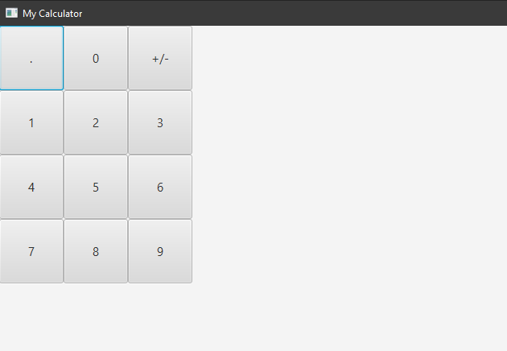
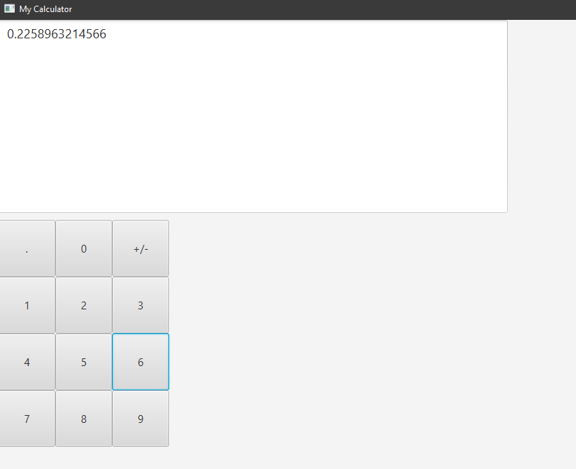

# My Calculator Project
Matthew Kounniyom: [github](https://github.com/mrkounniyom) [gitlab](https://gitlab.com/mrkounniyom)

### Introduction/Purpose
  Purpose of this project is to use a new GUI API for myself - JavaFX -> https://openjfx.io/ while also retaining some of my Java skills from Undergraduate.

### Tools/Language Selection
  Making use of ItelliJ-IDEA for development. Java seemed like a nice refresher for myself. When it came to picking JavaFX I wanted to try out a different GUI library than AWT or Swing, which I've used in Undergraduate projects. It looks fresh and modern.

# Updates Section

<details>
  <summary>Undocumented Updates</summary>

Started off the project and created basic mathematical functions via *operations.basicOperations.java* which includes but is not limited to addition, subtraction, multiplication and so forth. More advanced basic Calculator functions are in *operations.advOperations.java* which includes but is not limited to square root, square, negative/positive, etc.

Created some basic junit testing for the operations. Not entirely sure how to handle testing GUI stuff at the moment...
</details>

### 2-4-2022
- Added advanced Operations
- Added support for using JavaFx
- Created screenshot directory for screenshots from development.
- made a basic gui test

<details>
  <summary>Screenshot from testing...</summary>

  
</details>

### 2-6-2022
- Created logic to add number buttons
- Some of the issues I found were which pane I needed to use to get the buttons in a nice grid. Then needed to add a '.' and '+/-' for basic calculator functions. I am thinking I need to create a operation flip to adding into decimals.

<details>
  <summary>Screenshot from testing...</summary>

  
</details>


### 2-10-2022
- Looked at tutorial(s) and information on how event handling works in JavaFX.
- Implemented basic event handling to button to add text to the new text area that resides at the top.

<details>
  <summary>Screenshot from testing...</summary>

  
</details>

### 2-12-2022
- Added VERY basic arithmetic and changed how buttons are created/added.
- I ran into an issue where I needed to retain the current value in the text area after a function was pressed (ie: 34 + 3) then needing to concatenate onto that number vs. changing the number. I also added function to check if the number was 'whole' to retain whole numbers on screen when they are there... vs. doubles.

### 2-18-2022

- Ran into several issues today where I wanted to add the functionality of creating decimal numbers. (ie: pressing 1 + . + 2 should display 1.2 on the screen, so on and so forth.) The problem was how was catching the decimal separator and retaining a function value if it was already set. Like if I were to press 1, '+',  2, '.', 1 , '='- I should get an output of 3.1 and the text area should display 2.1 before hitting the '='.
- My code looks a little confusing to be honest. The below example is just the part for checking the button is not a number. The function tries to convert the button to a double and if it fails - return false. Then we check if we want to clear the screen. Then, is button not an '=' lets do something BUT check for '.' decimal conversion otherwise set the global variable of currentFunc to 'button'. This is only catching for the non-numbers...
```Java
if(!isNumber(button)) {
    if(button == "ce" || button == "c") {
        mainArea.setText("");
        currentFunc = "";
        previous = 0.0;
        return;
    }
    if(button != "=") {
        if(button == "." ) {
            adddec = true;
            if (button == "." && previous != 0.0) {
                mainArea.setText(button);
            }
            else mainArea.setText(mainArea.getText() + (button));
            return;
        }
        adddec = false;
        currentFunc = button;
        return;
    }
}
private boolean isNumber(String strNum) {
    if (strNum == null) {
        return false;
    }
    try {
        double d = Double.parseDouble(strNum);
    } catch (NumberFormatException nfe) {
        return false;
    }
    return true;
}
```
- If we look here - this is where it gets messy... I could probably get away with putting this into its own function so it is a little cleaner. Then re-write what we are doing as is hard to follow. I lean on adding returns and if/else to catch what is going on and to not break things.
```java
if(currentFunc != "") {
     if(adddec && equals) {
         adddec = false;
         currentValue = Double.valueOf(mainArea.getText());
     } else if (!adddec) {
         currentValue = Double.valueOf(mainArea.getText());
     }
     if(!equals && previous != 0.0 && !adddec) {
         if(currentFunc != "" && previous != 0.0) mainArea.setText(button);
         else mainArea.setText(mainArea.getText() + (button));
         return;
     }
     switch(currentFunc) {
         case "+":
             if(equals) {
                 mainArea.setText(String.valueOf(basicOperations.add(previous, currentValue)));
                 ifWhole();
                 break;
             }
             break;
         case "-":
             if(equals) {
                 mainArea.setText(String.valueOf(basicOperations.subtract(previous, currentValue)));
                 ifWhole();
                 break;
             }
             break;
         case "*":
             if(equals) {
                 mainArea.setText(String.valueOf(basicOperations.multiply(previous, currentValue)));
                 ifWhole();
                 break;
             }
             break;
         case "/":
             if(equals) {
                 mainArea.setText(String.valueOf(basicOperations.divide(previous, currentValue)));
                 ifWhole();
                 break;
             }
             break;
     }
     if(equals) {
         currentFunc = "";
         equals = false;
         previous = Double.valueOf(mainArea.getText());
         return;
     }
     if(!equals && previous == 0.0) previous = currentValue;
     if(adddec) { mainArea.setText(mainArea.getText() + (button)); return; }
     mainArea.setText(button);
     return;
}
```
