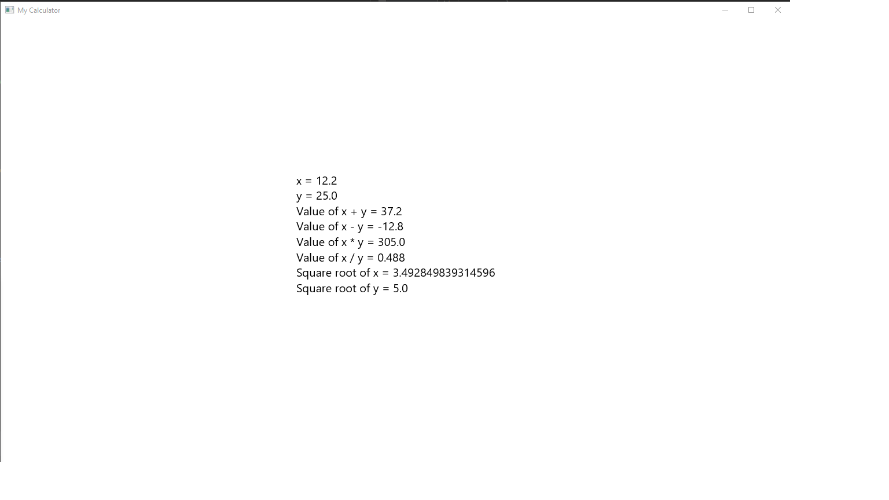

# My Calculator

### Introduction/Purpose
  Purpose of this project is to use a new GUI API for myself - JavaFX -> https://openjfx.io/ while also retaining some of my Java skills from Undergraduate.

### Tools/Language Selection
  Making use of ItelliJ-IDEA for development. Java seemed like a nice refresher for myself. When it came to picking JavaFX I wanted to try out a different GUI library than AWT or Swing, which I've used in Undergraduate projects. It looks fresh and modern.

# Updates Section

### Undocumented Updates
Started off the project and created basic mathematical functions via *operations.basicOperations.java* which includes but is not limited to addition, subtraction, multiplication and so forth. More advanced basic Calculator functions are in *operations.advOperations.java* which includes but is not limited to square root, square, negative/positive, etc.

Created some basic junit testing for the operations. Not entirely sure how to handle testing GUI stuff at the moment...

### 2-4-2022
- Added advanced Operations
- Added support for using JavaFx
- Created screenshot directory for screenshots from development.
- made a basic gui test

Screenshot from testing...

